# Google_Foobar_Challenges
Recently I have got invited from google foobar challenges. I am currently now in `Level 4`. 
The problems I faced so far was basically algorithm releted and some gave me such hard time solving them. 

## Level 1
`Level 1` contains one problem. The problem I faced in this level titled `The Cake is not a Lie` 
This problem was pretty straight cut problem. 
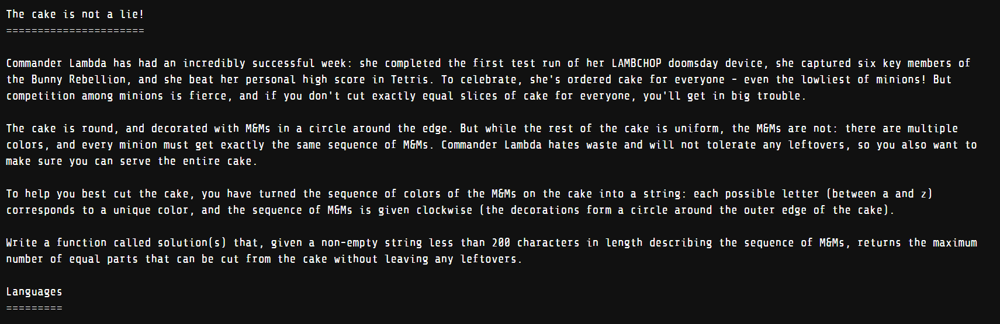
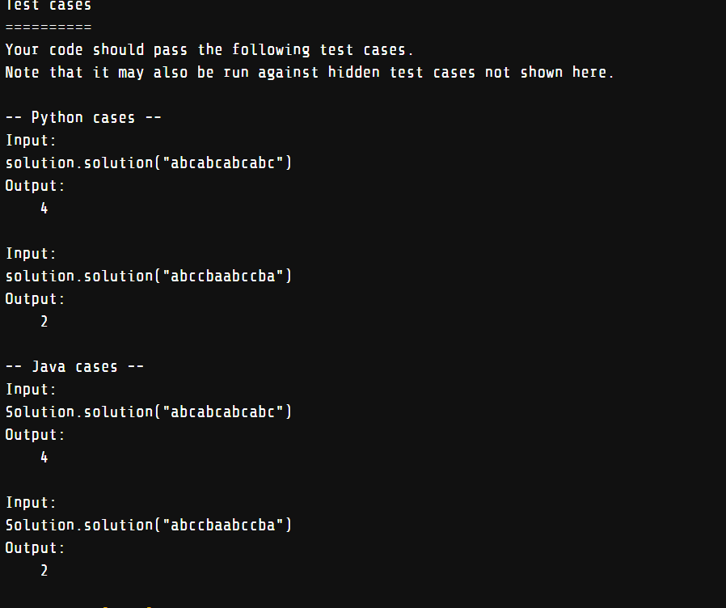

## Level 2 
`Level 2` conatins 2 Problem. 
First Problem was `Number station coded message` 
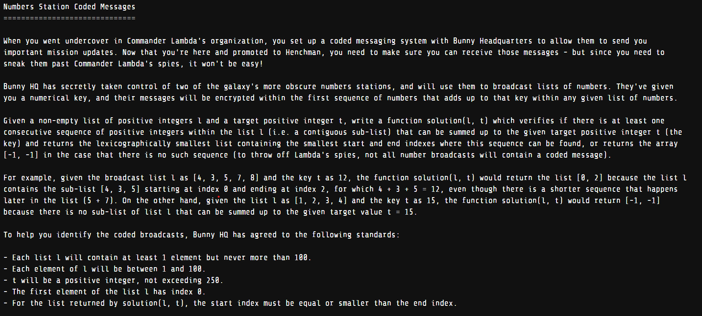
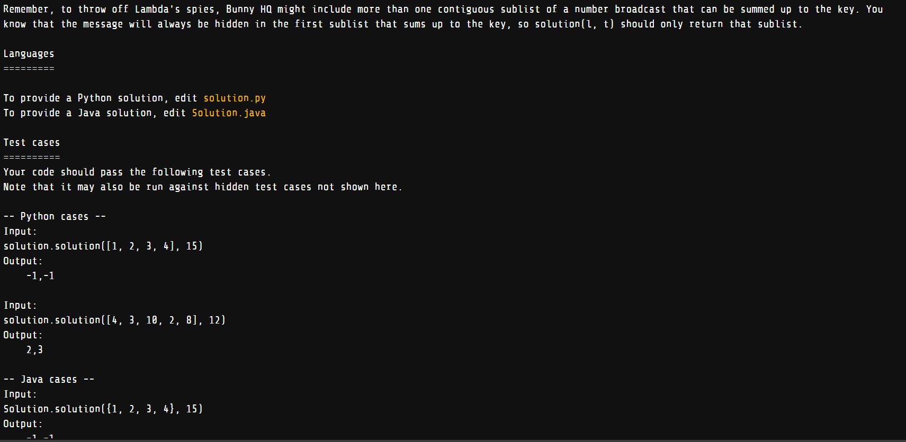

Second problem was `Lovely Lucy LAMBs` 
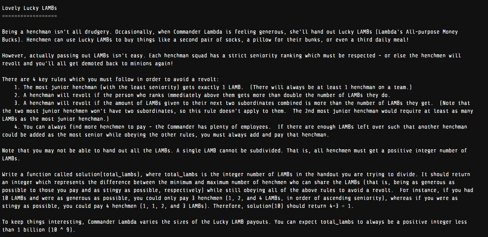
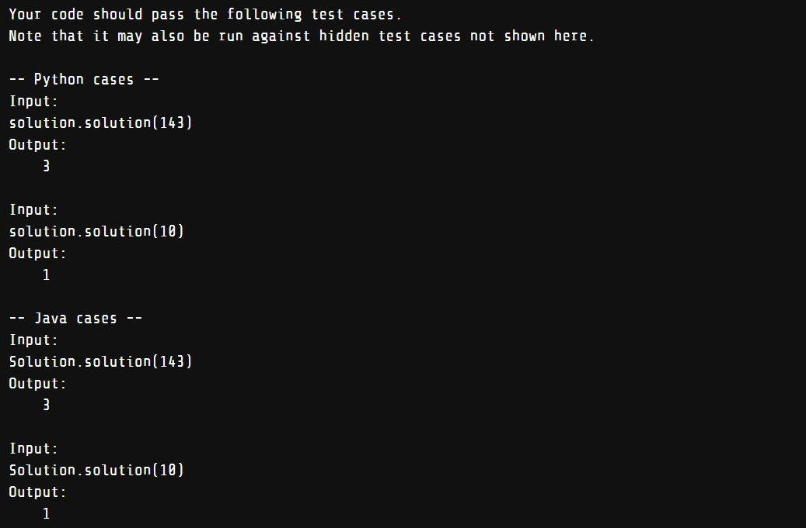

## Level 3 
`Level 3` conatins total 3 problems  
The First Problem I faced titled `Fuel Injection Perfection` and this was basic `Number theory` 
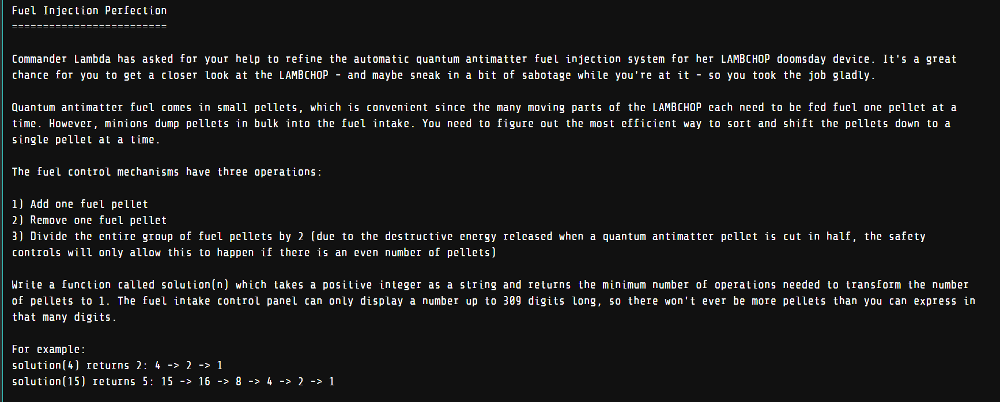

The Second problem titled `Prepare the Bunnies Escape` and this problem I solved using `graph theory`.  
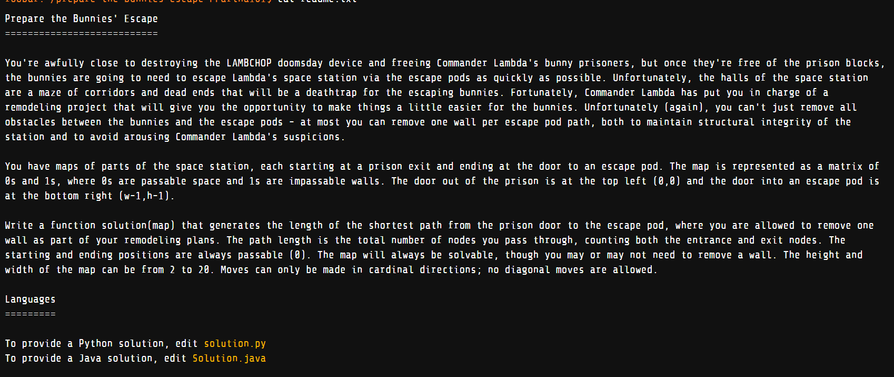
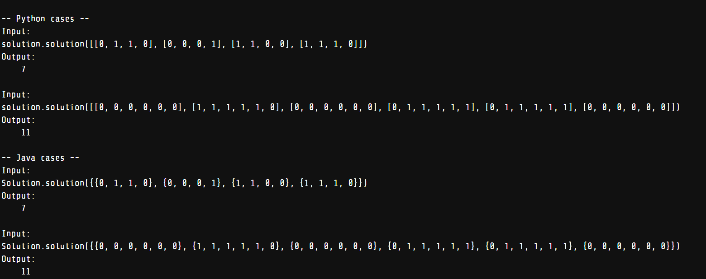

The Third problem titled `Find the Access Codes`.
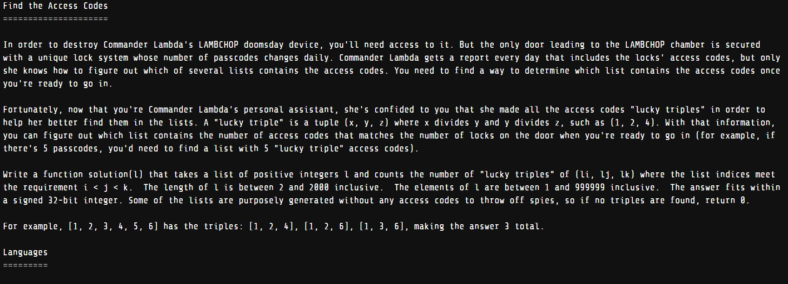
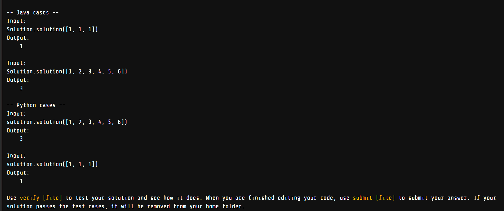

`Happy Coding`
